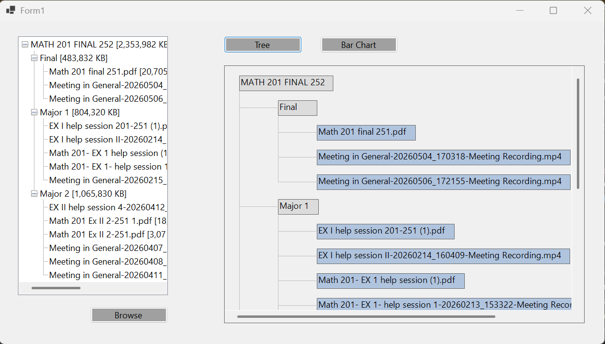
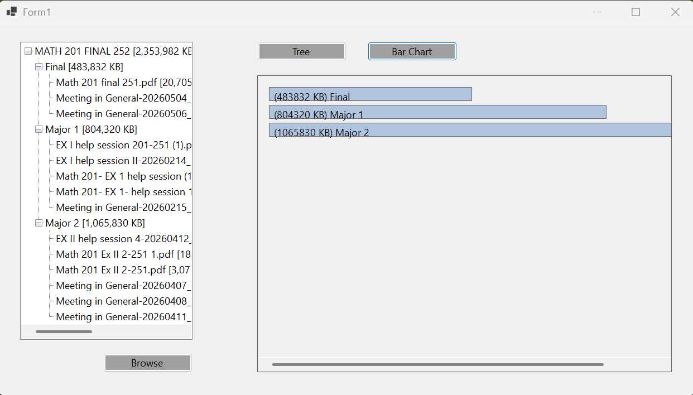

# Folder Traverser and Visualizer

## Project Overview
This project is a desktop application built with **VB.NET** in **Visual Studio 2022**.  
It lets the user choose a folder, reads its files and subfolders recursively, calculates folder sizes, and displays the structure in two visual styles: **Tree** and **Bar Chart**.

## Main Features
- Browse and select a folder
- Recursively traverse folders and files
- Show file name, size, and extension
- Calculate the size of folders and subfolders
- Switch between **Tree** and **Bar Chart** visualization
- Display the result inside the main form with scrollbars when needed

## Design Pattern Used
### Composite Pattern
The folder structure follows the **Composite Design Pattern**:
- **Folder** acts as a composite because it can contain files or other folders
- **File** acts as a leaf because it cannot contain children
- Both are handled in a similar way when traversing and visualizing the structure

### Strategy Pattern
The visual output can change between **Tree** and **Bar Chart**.  
This is a good use of the **Strategy Pattern** because the application can switch the visualization method without changing the main logic.

## Technologies
- **Language:** VB.NET
- **IDE:** Visual Studio 2022
- **Platform:** Windows Forms
- **Approach:** Object-oriented design

## How It Works
1. The user clicks **Browse** and selects a folder.
2. The program reads the folder contents recursively.
3. The app builds the internal folder/file structure.
4. Folder sizes are calculated.
5. The structure is shown using either:
   - **Tree view style**
   - **Bar chart style**

## Notes
- The visualization is drawn by code.
- The interface is responsive to form resizing.
- Scrollbars appear when the content is larger than the panel.

## Screenshot

1. Tree visualization

2. Bar Chart visualization

