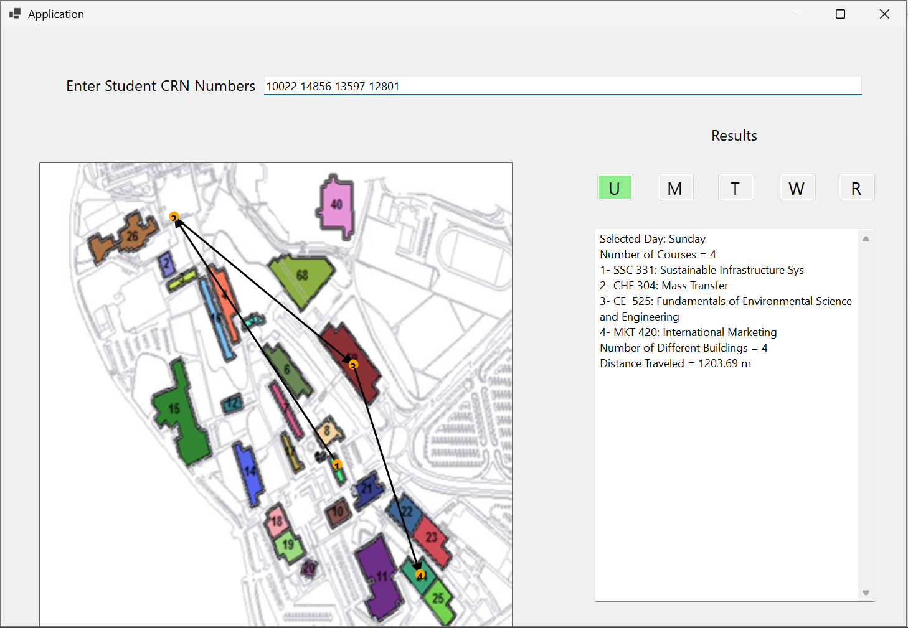

# Student Schedule Route Visualizer

## Overview
Student Schedule Route Visualizer is a Windows Forms application built with **VB.NET** in **Visual Studio 2022**.

The application reads an Excel schedule file, lets the user enter CRN numbers, selects a weekday, and draws the student’s route between classes on a campus map.

## Features
- Read schedule data from Excel
- Enter multiple CRN numbers
- Select a day from Sunday to Thursday
- Draw the route on a panel
- Show selected day, number of courses, course list, number of buildings, and total distance
- Update the visualization when the day changes

## Main Classes
- `ScheduleReader` — reads Excel data and creates objects
- `Section` — stores CRN, section number, course, schedule, and room
- `Course` — stores course code, name, and department
- `Department` — stores department name
- `Schedule` — stores days and class times
- `Room` — stores room number and building
- `Building` — stores building number
- `IScheduleFeature` — common interface for schedule features
- `DaySetterFeature` — converts day codes to full day names
- `CourseCountFeature` — counts courses
- `CourseListFeature` — lists courses
- `BuildingCountFeature` — counts different buildings
- `DistanceFeature` — calculates total travel distance

## Design Principles
This project follows good object-oriented design by using:
- Abstraction
- Encapsulation
- Single Responsibility Principle
- Open-Closed Principle

## Technologies
- VB.NET
- Windows Forms
- Visual Studio 2022
- Microsoft Office Interop Excel

## How It Works
1. The user enters CRN numbers.
2. The user selects a weekday.
3. The program reads and filters the matching sections.
4. The route is drawn on the campus map.
5. Results are shown in the text area.

## Screenshot

###Campus Route visualization

## Author

**Raneem Alshahrani**  
KFUPM – SWE 316  
Assignment 1
